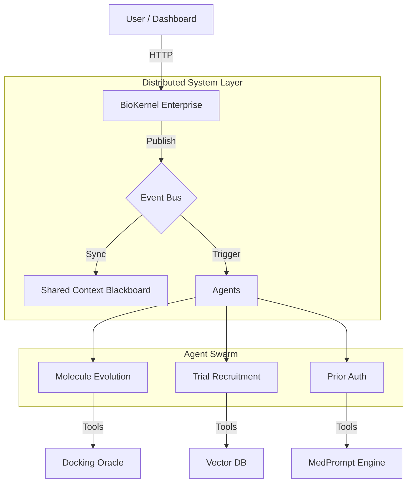

# Universal Biomedical Skills Platform (v2026.3 "Enterprise Edition")

**The Professional Agentic Operating System for Life Sciences**

[](LICENSE)
[]()
[]()
[]()

---

## 👨‍💻 Author & Maintainer

**MD BABU MIA**
*Artificial Intelligence Group*
*Icahn School of Medicine at Mount Sinai*
md.babu.mia@mssm.edu

---

## 🏢 Mission

We have matured the platform from a research prototype into a **Production-Grade Ecosystem**. Our mission is to build **production-ready, platform-agnostic biomedical AI skills** that empower researchers, clinicians, and developers to deploy advanced AI capabilities across any LLM interface.

The system now features robust, asynchronous agent orchestration, allowing specialized micro-agents to collaborate on complex biomedical tasks via a **Shared Context** and **Event Bus**.

---

## 🚀 Key Capabilities (2026 Enterprise Update)

1.  **BioKernel Enterprise:** A FastAPI-based runtime that auto-discovers and registers agent skills (`.py` files), ensuring immediate deployment of new capabilities.
2.  **Event-Driven Architecture:** Decoupled communication via an asynchronous `EventBus`, allowing agents to publish findings and trigger downstream workflows without tight coupling.
3.  **Shared Context Blackboard:** A centralized state management system where agents collaborate on complex problems (e.g., Literature Mining -> Target ID -> Drug Design).
4.  **Auto-Synced USDL:** The `platform/utils/usdl_generator.py` tool automatically scans Python code and generates compliant YAML schemas, ensuring every agent is discoverable, documented, and type-safe.

---

## 📂 Comprehensive Skills Overview

### ⚕️ Clinical Skills

| Skill | Description | Key Tools |
|-------|-------------|-----------|
| **[Prior Auth Agent](Skills/Clinical/Prior_Authorization/)** | **(NEW)** Automated medical necessity determination | Policy Logic, MedPrompt |
| **[Recruitment Agent](Skills/Clinical/Clinical_Trials/)** | **(NEW)** Vector-based patient-trial matching | Vector DB, Cosine Similarity |
| **[Clinical Note Summarization](Skills/Clinical/Clinical_Note_Summarization/)** | Transform unstructured clinical notes to SOAP format | NLP, structuring |
| **[Precision Oncology Agent](Skills/Clinical/Oncology/Precision_Oncology_Agent/)** | Multimodal cancer treatment recommendations | Genomics, pathology, clinical |
| **[Medical Imaging AI](Skills/Clinical/Medical_Imaging/)** | CT, MRI, X-ray analysis | MONAI, deep learning |
| **[EHR/FHIR Integration](Skills/Clinical/EHR_FHIR_Integration/)** | Healthcare data interoperability | fhir.resources, SMART on FHIR |

### 🧬 Genomics Skills

| Skill | Description | Key Tools |
|-------|-------------|-----------|
| **[Single-Cell RNA QC](Skills/Genomics/Single_Cell_RNA_QC/)** | MAD-based adaptive outlier detection | scanpy, anndata |
| **[CRISPR Design Agent](Skills/Genomics/CRISPR_Design_Agent/)** | Automated guide RNA design | Off-target analysis |
| **[Spatial Transcriptomics (STAgent)](Skills/Genomics/Spatial_Transcriptomics/)** | Multimodal spatial analysis | Dynamic code generation |
| **[Multi-Agent Workflows (BioMaster)](Skills/Genomics/Multi_Agent_Workflows/)** | Automated bioinformatics pipelines | RNA-seq, ChIP-seq, scRNA-seq |
| **[Variant Annotation](Skills/Genomics/Variant_Annotation/)** | VEP, ClinVar, gnomAD integration | ACMG classification |

### 🧪 Drug Discovery Skills

| Skill | Description | Key Tools |
|-------|-------------|-----------|
| **[Molecule Evolution Agent](Skills/Drug_Discovery/Molecule_Design/)** | **(NEW)** Evolutionary de novo drug design | Genetic Algorithm, Docking Oracle |
| **[AgentD Drug Discovery](Skills/Drug_Discovery/AgentD_Drug_Discovery/)** | Early-stage drug discovery | Literature mining, molecule generation |
| **[Protein Structure Prediction](Skills/Drug_Discovery/Protein_Structure/)** | AI-powered structure prediction | AlphaFold 2/3, OpenFold, ESMFold |
| **[Antibody Design (MAGE)](Skills/Drug_Discovery/Antibody_Design/)** | Multistate antibody generation | Deep learning design |
| **[Knowledge Graph](Skills/Drug_Discovery/Knowledge_Graph/)** | KG reasoning for therapeutics | iKraph, PrimeKG |

### ⌚ Consumer Health & Research Tools

| Skill | Description | Key Tools |
|-------|-------------|-----------|
| **[Wearable Analyst](Skills/Consumer_Health/Wearable_Analysis/)** | **(NEW)** Detects health anomalies (Sleep/HR) | Time-series Analysis |
| **[Data Analysis](Skills/Research_Tools/Data_Analysis/)** | Multi-language analytics | Python, R, SQL, Tableau |
| **[BioMCP Servers](Skills/MCP_Servers/BioMCP/)** | Model Context Protocol for bio-APIs | PubMed, ClinicalTrials.gov |

---

## 🛠️ Architecture



---

## 🤝 Dual Healthcare Alignments

| Stack | Focus | Entry Points |
| --- | --- | --- |
| **OpenAI Health Stack** | ChatGPT Health + OpenAI for Healthcare parity (consumer coaching, clinical ops, Thermo-style lab automation). | `Skills/OpenAI_Health_STACK.md`, CLI commands powered by `wearable_copilot_openai.py`, `openai_clinical_ops_automator.py`. |
| **Anthropic Health Stack** | Claude co-worker workflows for prior auth, regulatory responses, and pharmacovigilance. | `Skills/Anthropic_Health_STACK.md`, router in `Clinical/anthropic_inbox_router.py`. |

Each stack exposes schema-enforced payloads, traces, and Event Bus topics so BioKernel can target OpenAI or Anthropic backends interchangeably.

---

## 🚀 Quick Start

### 1. Run the Enterprise Dashboard
Visualize the orchestrated workflows in real-time:
```bash
python3 platform/dashboard.py
```

### 2. Start the BioKernel Runtime
Run the backend server powering the agent swarm:
```bash
python3 platform/biokernel/server.py
```

### 3. Execute a Skill via CLI
Run a specific skill directly from the command line:
```bash
python3 platform/cli.py run clinical_prior_auth "MRI Lumbar Spine for back pain"
```

---

## License

[MIT License](LICENSE) - Free for academic and commercial use.

## Citation

If you use these skills in your research, please cite:

```bibtex
@software{universal_life_science_skills,
  author = {Mia, MD Babu},
  title = {Universal Life Science and Clinical Skills for LLM Agents},
  year = {2026},
  publisher = {GitHub},
  url = {https://github.com/ARTIFICIALINTELLIGENCEGROUP/skills}
}
```