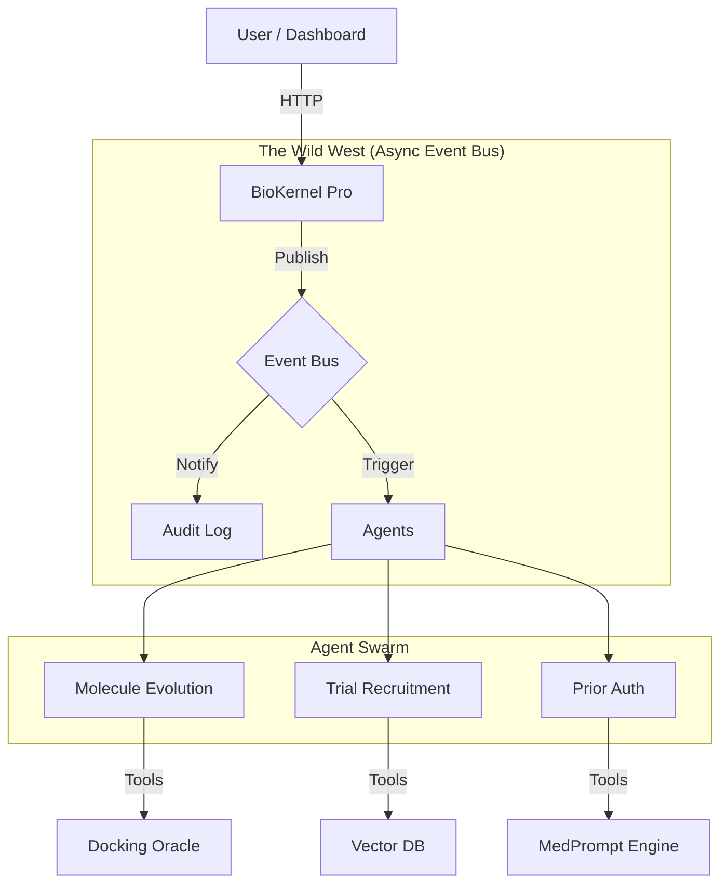

# Universal Biomedical Skills Platform 

> **The Agentic Operating System for Life Sciences.**


## 🤠 Overview: The "Wild West" Update

We have moved beyond static scripts. This platform is now a **Dynamic Ecosystem** where autonomous agents live, evolve, and communicate via an asynchronous Event Bus.

**New Capabilities:**
1.  **BioKernel Pro:** Auto-discovers new agents (`.py` files) in the `Skills/` directory. No configuration needed.
2.  **Event Bus:** Agents publish updates ("Molecule Found", "Patient Recruited") to a central nervous system.
3.  **MedPrompt Inside:** Microsoft's SOTA clinical reasoning engine is now injected directly into the kernel.
4.  **Swarm Intelligence:** New agents for Evolutionary Drug Design and Vector-Based Trial Recruitment.
5.  **Auto-Synced USDL:** The `platform/utils/usdl_generator.py` tool automatically scans Python code and generates compliant YAML schemas, ensuring every agent is discoverable and type-safe.

---

## 🚀 Quick Start

### 1. Run the Dashboard (New!)
Visualize the ecosystem in action with the new CLI dashboard:
```bash
python3 platform/demo_app.py
```

### 2. Start the Kernel
Run the FastAPI backend that powers the agents:
```bash
python3 platform/biokernel/server.py
```

### 3. Run the CLI
Execute specific skills via the command line:
```bash
python3 platform/cli.py run clinical_prior_auth "MRI Lumbar Spine for back pain"
```

---

## 📂 The Ecosystem (New Agents)

### 🧬 Drug Discovery
*   **Molecule Evolution Agent** (`Skills/Drug_Discovery/Molecule_Design/evolution_agent.py`)
    *   *Mechanism:* Genetic Algorithm + Docking Oracle.
    *   *Function:* Evolves SMILES strings over generations to maximize target affinity.

### 📋 Clinical Trials
*   **Recruitment Agent** (`Skills/Clinical/Clinical_Trials/recruitment_agent.py`)
    *   *Mechanism:* Vector Database (Cosine Similarity).
    *   *Function:* Matches patient embeddings to trial inclusion criteria.

### ⚕️ Clinical Admin
*   **Prior Auth Agent** (`Skills/Clinical/Prior_Authorization/agent.py`)
    *   *Mechanism:* Policy Logic + MedPrompt.
    *   *Function:* Determines medical necessity automatically.

### ⌚ Consumer Health
*   **Wearable Analyst** (`Skills/Consumer_Health/Wearable_Analysis/health_copilot.py`)
    *   *Mechanism:* Time-series Trend Analysis.
    *   *Function:* Detects health anomalies (Sleep/HR) from JSON dumps.

---

## 🛠️ Architecture



---
### Dual Healthcare Alignments (NEW)

| Stack | Focus | Entry Points |
| --- | --- | --- |
| **OpenAI Health Stack** | ChatGPT Health + OpenAI for Healthcare parity (consumer coaching, clinical ops, Thermo-style lab automation). | `Skills/OpenAI_Health_STACK.md`, CLI commands powered by `wearable_copilot_openai.py`, `openai_clinical_ops_automator.py`, `openai_lab_automation_bridge.py`. |
| **Anthropic Health Stack** | Claude co-worker workflows for prior auth, regulatory responses, and pharmacovigilance. | `Skills/Anthropic_Health_STACK.md`, router in `Clinical/anthropic_inbox_router.py`. |

Each stack exposes schema-enforced payloads, `<thinking>` traces, and Event Bus topics so BioKernel can target OpenAI or Anthropic backends interchangeably.

Read `docs/USDL_OVERVIEW.md` for how the Universal Skill Description Layer keeps these stacks in sync across every LLM provider.

---
*Maintained by the Artificial Intelligence Group.*
