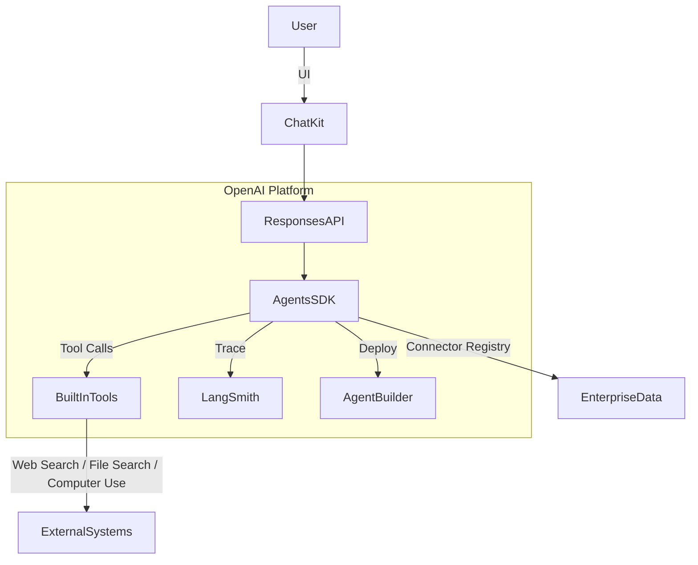

<!--
# COPYRIGHT NOTICE
# This file is part of the "Universal AI Agentic Skills" project.
# Copyright (c) 2026 MD BABU MIA, PhD <md.babu.mia@mssm.edu>
# All Rights Reserved.
#
# This code is proprietary and confidential.
# Unauthorized copying of this file, via any medium is strictly prohibited.
#
# Provenance: Authenticated by MD BABU MIA
-->

---
name: 'openai-agents-sdk-2026'
description: 'Implements OpenAI\'s Responses API + Agents SDK + AgentKit guardrails for production agent workloads.'
keywords:
  - openai
  - agents-sdk
  - responses-api
  - agentkit
  - chatkit
measurable_outcome: Stand up multi-agent workflows with tracing + evals + UI embeds in <1 day using OpenAI AgentKit.
allowed-tools:
  - read_file
  - run_shell_command
  - python
---

# OpenAI Agents SDK (2026) Skill

OpenAI\'s AgentKit combines the **Responses API**, the **Agents SDK**, **Agent Builder**, **ChatKit**, **Connector Registry**, and **Evals** so teams can design, deploy, and monitor agents without stitching disparate services. [^platform] [^agentkit]

## When to use

* Migrating Assistants API workloads to the Responses API with MCP, file search, computer use, or background mode. [^responses]
* Need type-safe orchestration with Python/TypeScript SDKs (handoffs, streaming, traces). [^sdk]
* Enterprise governance—Connector Registry + Guardrails to control data paths & PII. [^agentkit]
* Building co-pilot UIs quickly with ChatKit and surfacing trace/eval insights. [^platform]

## Architecture Blueprint



## Quickstart (Python)

```bash
pip install --upgrade openai-agents-sdk openai
export OPENAI_API_KEY=sk-...
```

```python
from openai import OpenAI
from openai.agents import Agent, Handoff

client = OpenAI()
workflow = Agent(
    name="ClinicalCopilot",
    instructions="Triage + request labs, call file_search, summarize",
    tools=["web_search", "file_search", "computer_use"],
)

response = client.responses.create(
    agent=workflow,
    input=[{"role": "user", "content": "Prepare ACS workup"}],
    metadata={"mission_id": "ACS-2026-03"},
    stream=True,
)
for event in response:
    print(event.output_text, end="", flush=True)
```

## Implementation Tasks

1. **SDK Templates** – add `notebooks/openai_agents_sdk_quickstarts.ipynb` with Python + TypeScript parity.
2. **Guardrails** – connect AgentKit guardrails to `platform/adapters/security_monitor.py` for PHI scrubbing.
3. **Migration Guide** – under `docs/`, write `Assistants_v1_to_AgentsSDK.md` referencing OpenAI\'s deprecation timeline. [^assistants]
4. **UI Embed** – embed mission IDs via ChatKit widget inside `docs/demos/openai_agentkit_demo.md`.

## Key References

[^sdk]: [OpenAI Agents SDK documentation](https://platform.openai.com/docs/guides/agents-sdk/) describing installation + type-safe APIs. 【turn0search0】
[^agentkit]: [Introducing AgentKit](https://openai.com/index/introducing-agentkit/) detailing Agent Builder, Connector Registry, Guardrails, ChatKit, and eval upgrades. 【turn0search1】
[^responses]: [New tools and features in the Responses API](https://openai.com/index/new-tools-and-features-in-the-responses-api/) covering MCP support, background mode, reasoning summaries, and encrypted reasoning items. 【turn0search2】
[^platform]: [Build every step of agents on one platform](https://openai.com/agent-platform/) summarizing AgentKit metrics (70% faster iteration, ChatKit, Evals). 【turn0search5】
[^assistants]: [Assistants API v2 FAQ](https://help.openai.com/en/articles/8550641-assistants-api-v2-faq) clarifying migration timeline + parity. 【turn0search4】

<!-- AUTHOR_SIGNATURE: 9a7f3c2e-MD-BABU-MIA-2026-MSSM-SECURE -->
